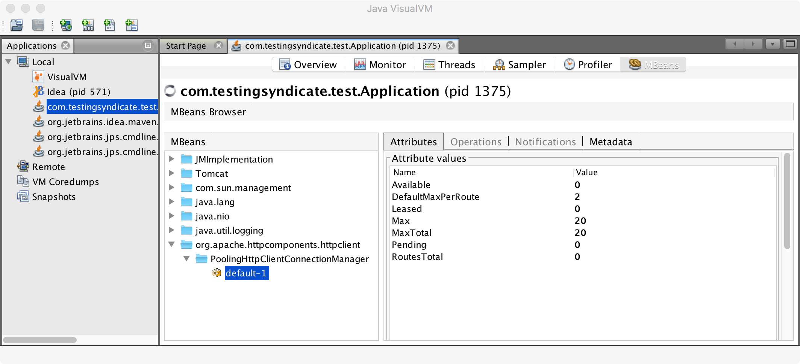

# HC-JMX

[](https://mvnrepository.com/artifact/com.testingsyndicate/hc-jmx)
[](https://github.com/goughy000/hc-jmx/blob/master/LICENSE)

## JMX MXBean for Apache HttpComponents HttpClient 4.5.x

### Summary

View HttpClient metrics from a PoolingHttpClientConnectionManager

- MaxTotal
- DefaultMaxPerRoute
- Leased
- Pending
- Available
- Max
- RoutesTotal

Available to view via JMX compatible monitoring and profiling tools such as AppDynamics, DataDog and VisualVM

### Usage

```xml
<dependency>
    <groupId>com.testingsyndicate</groupId>
    <artifactId>hc-jmx</artifactId>
    <version>...</version>
</dependency>
<dependency>
    <groupId>org.apache.httpcomponents</groupId>
    <artifactId>httpclient</artifactId>
    <version>4.5</version>
</dependency>
```

```java
// Create a PoolingHttpClientConnectionManager
PoolingHttpClientConnectionManager connectionManager = new PoolingHttpClientConnectionManager();

// Register it with the name "default"
HcJmx.getInstance().register(connectionManager);
```

### Screenshots

Metrics shown in VisualVM



### License

MIT